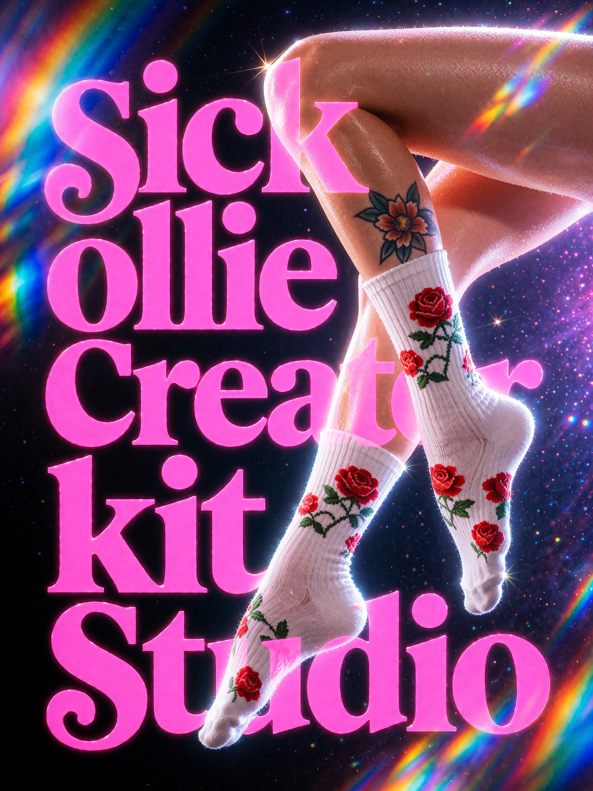

# SICK OLLIE Creator Studio + Toolkit v4.0.0

## Library packs

[**Download the Starter Library Pack on Civitai**](https://civitai.red/models/2811445/sick-ollie-creator-studio). More library packs coming soon.

A connected ComfyUI workspace for reusable prompts, LoRA testing, outfit assembly, image comparison and metadata-aware saving.

**Choose → Load → Generate → Compare → Save → Reuse.**

[User Manual (PDF)](docs/SICK-OLLIE-v4-User-Manual.pdf) · [Searchable manual](docs/USER_MANUAL.md) · [Patch notes](RELEASE_NOTES.md) · [Launch highlights](LAUNCH_HIGHLIGHTS.md)

## Install or update

Use a compatible ComfyUI installation with the LiteGraph workflow canvas, Python 3.10+ and **rgthree-comfy**. Loader imports rgthree’s shared model-information services. Select diffusion, text-encoder and VAE files compatible with each other; model weights are not included.

1. Back up your configured ComfyUI user directory and `input/SickOllieLogs/` before updating.
2. Close ComfyUI. Put the single `ComfyUI-SickOllie` folder inside `ComfyUI/custom_nodes/`, replacing the existing extension when updating. Avoid a double-nested folder.
3. Restart ComfyUI fully and hard-refresh the frontend (`Ctrl+F5`).
4. Open your existing workflow or build the simple graph below. Reselect any missing local model files.

The extension uses dependencies supplied by the ComfyUI environment. Optional Civitai features need internet access. This release ships with **no starter logs, sample workflows, bundled Library Packs or old manuals**. Normal extension updates leave user-owned Library data intact.

## Five-minute start

Add Loader Core, Prompt Core, Generation Core, Output Core and Preview Core from the node menu.

| Connect | To |
|---|---|
| Loader `model` | Generation `model` |
| Prompt `final_prompt` | Generation `positive_text` |
| Generation `samples` + `vae` | Output `samples` + `vae` |
| Output `images` | Preview `images` |
| Loader `main_trigger` (optional) | Prompt `main_trigger` |

Choose an installed diffusion model in Loader and compatible Text encoder, VAE and CLIP type in Generation. Keep Main LoRA disabled for a base-model check, or enable an installed LoRA at your chosen strength. Use Manual in Prompt Core, enter a complete description, choose a modest canvas and queue once with model-appropriate sampling settings.

Press **Pin + Compare**, change one thing and generate again. **Clear** removes the reference. **Save to Library** preserves the displayed image and available generation state.

## The four Creative Library areas

Open **Studio Hub → Creative Library**.

| Area | Use it for |
|---|---|
| Templates | Reusable text with recognized unresolved placeholders |
| Prompts | Resolved, token-free prompt assets |
| Outfits | Wardrobe pieces and complete Looks |
| Scenes | Reusable locations and environments |

**Home = where it lives. Collection = a reusable grouping that does not move it.**

Click a thumbnail or **View** for the large Inspector. Browse with Left/Right, rate with 1–5, clear with 0, and use the applicable copy, load, edit or preview actions. Inspector zoom is relative to Fit.

**Load** changes the current graph. **Queue** submits the asset and restores visible working state. **Queue Next** fronts pending Prompt/Template work. **Generate Previews** tests selected assets or a deliberate wider scope, with optional live Theater review.

To populate an empty Library, import your own TXT logs or a separately supplied `.soslibrary` pack through **Library Menu → Library Pack → Import Library Pack**. The pack dialog previews contents and selection before merging. No content is imported automatically.

## The connected Core nodes

- **Loader:** diffusion model, Main LoRA, physical/Collection scope, secondary stack, trigger resolution and independent model/Main After Generate controls.
- **Prompt:** Manual, Prompt Input or Prompt Log; independent Manual/log Outfit A/B/C and Scene sources; explicit component and trigger placement; Collection-backed pools.
- **Generation:** compatible encoding, dimensions, sampling, seed and live applied LoRAs. Optional `seed_input` overrides the widget for the run.
- **Output:** save decoded latents or connected images, compose output names and preserve selected metadata.
- **Preview:** presentation controls plus Pin + Compare, Clear and Save to Library.
- **Image Metadata:** inspect an image, copy available Final/Source Prompt, components and seed, or Save to Library. Connect prompt text to `manual_prompt_input` and select Prompt Input; connect recovered Seed to `seed_input`. Keep Metadata outside the output-feedback path to avoid a graph cycle.

## Model review and outfits

**LoRA Library** browses, tests, reviews, queues, thumbnails and groups installed LoRAs. Its Yearbook supports controlled comparison and numeric checkpoint order. Theater uses Favorite, Like/Keep, Retest and Reject, separately from Creative Library stars.

**LoRA Organizer** handles reviewed filesystem naming, moves and cleanup. Scan first, inspect the plan, then apply deliberately.

**Outfit Builder** combines Wardrobe pieces into Looks with editable attributes. **Outfit Forge** is an optional local beta generator for editable complete Look logs; review Constraint Fidelity and Brief Coverage before publishing to Looks.

## Data and compatibility

The catalog normally lives at `ComfyUI/user/SickOllie/solo_catalog.sqlite3`; Creative previews share `creative_library_previews/` beside it. Logs live beneath `ComfyUI/input/SickOllieLogs/`. Actual roots follow ComfyUI configuration. Forge drafts and UI preferences use browser local storage. If ComfyUI supplies no user root, the catalog has an extension-local `data/` fallback: inspect your actual paths before replacing files.

Classic node IDs, compatible generated-log references, legacy Preview migration and older Log Organizer workflow registration remain supported. Schema numbers and internal engine versions are not product release labels. Sample Classic workflows and historical guides are intentionally not bundled.

For portability, export a Library Pack. For installation recovery, also preserve user data, logs and relevant models. See the manual for migration boundaries, destructive maintenance and troubleshooting.
