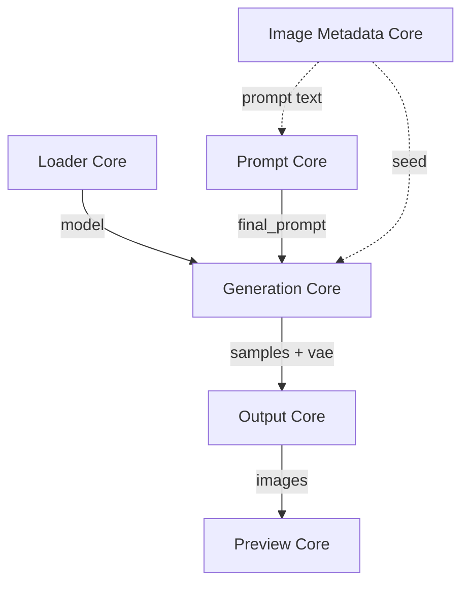

# SICK OLLIE Creator Studio + Toolkit v4.0.0 User Manual

Choose → Load → Generate → Compare → Save → Reuse.

## Your first five minutes
PDF page 4 · START HERE

Choose → Load → Generate → Compare → Save → Reuse

### 01 / Choose your engine

Add Loader Core, Prompt Core, Generation Core, Output Core and Preview Core from the ComfyUI node menu. Wire them as shown on the next page. In Loader Core, choose an installed diffusion model. In Generation Core, select its compatible text encoder, VAE and CLIP type. Select settings appropriate to your own model before queueing; the package includes no sample workflow or model weights.

### 02 / Make one image

Keep Main LoRA disabled for a first base-model check, or enable an installed LoRA and set its strength. Set Prompt Core to Manual and enter a complete description, such as: photo of a woman wearing a cyan rain jacket in a sunlit greenhouse. Choose a modest canvas and queue once. Generation Core sends samples and VAE to Output Core; Output saves and passes images to Preview Core.

### 03 / Keep the result useful

Press Pin + Compare on a result you want to study. Change one prompt or model setting and generate again. Clear removes the reference. Save to Library preserves the displayed result with available generation information. Open Creative Library from Studio Hub when you want to reuse it.

### Start small, then automate

First make one successful image. Then import your own TXT content or a separately supplied Library Pack, try a Template, and test a small preview run. Installed model files are selected locally; they are not bundled.

## One connected studio
PDF page 5 · START HERE

The Library supplies reusable choices. The nodes turn those choices into images.

### What travels between systems

| Control / choice | Behavior |
|---|---|
| LoRA Library → Loader | An installed LoRA or Collection scope |
| Templates / Prompts → Prompt | Reusable source or resolved prompt text |
| Wardrobe / Looks / Scenes → Prompt | Outfit A/B/C and Scene values |
| Metadata → Prompt + Generation | Recovered text and an available seed |
| Preview / Metadata → Creative Library | An image plus reusable generation information |

### A useful separation

Generation Core produces latent samples and a VAE. Output Core decodes and saves them in a simple Studio workflow, then supplies the IMAGE used by Preview Core. Image Metadata Core is a separate reuse station.

## Four creative libraries
PDF page 6 · THE CREATIVE LIBRARY

Find the ingredient by what you want to reuse.

| TEMPLATES | PROMPTS |
|---|---|
| Formulas with recognized unresolved placeholders. Example: photo of a woman wearing OUTFIT in SCENE. | Resolved, token-free text. Example: photo of a woman wearing a cyan rain jacket in a greenhouse. |

| OUTFITS | SCENES |
|---|---|
| Wardrobe holds pieces and styling material. Looks holds complete outfit values ready for an Outfit slot. | Location and environment values ready for Prompt Core’s Scene component. |

| HOME | COLLECTION |
|---|---|
| Where the asset lives: its canonical category/subcategory. Move Home changes that location. | A reusable creative grouping. One asset can participate in multiple Collections without moving. |

### Open the right workspace

Studio Hub brings together Creative Library, LoRA Library, Outfit Forge and LoRA Organizer. Creative Library manages text and generation assets. LoRA Library manages the visual review of installed model files.

## Save something you can use again
PDF page 7 · THE CREATIVE LIBRARY

An image becomes more valuable when its source survives.

| SAVE TO LIBRARY | GENERATE PREVIEW |
|---|---|
| Capture a displayed generation or a metadata-bearing image as reusable Library material. Available prompt assembly and settings travel with it. | Run existing Library assets through the active Studio workflow to create or replace their review images. |

| SOURCE / REUSABLE | THUMBNAIL COMBINATION |
|---|---|
| The portable prompt formula. Keep identity-related placeholders such as NAME and BRAND reusable when the captured data supports them. | The resolved Outfit and Scene combination represented by the image. Choose this when the captured styling is the starting point. |

### Load with intention

On a Prompt or Template, choose Load and inspect the apply choices. Loading changes the active graph. Available source or captured component information can be applied; missing image metadata cannot be reconstructed by the Library.

### Saved Generation Recipes

A Recipe preserves generation state behind saves, image imports and reuse. It is an advanced asset that supports the four creative libraries, rather than another beginner tab to learn.

## Review at full size
PDF page 8 · THE CREATIVE LIBRARY

Click a thumbnail or View. Loading the asset is a separate action.

### One stable review session

The large window stays fixed relative to your viewport. Metadata scrolls independently of the image. Left and Right browse the active filtered Home or Collection, including items beyond the current gallery page. Rating changes do not reorder that open session; reopen to adopt a new filter order.

| FIT + ZOOM | RATE + DELETE |
|---|---|
| Fit shows the whole image. − and + range from 50% to 400% of Fit. Click the image to switch Fit / 200% of Fit; scroll to pan. This is not a native-pixel percentage. | Use the stars or keys 1–5. Key 0 clears; clicking the current star rating also clears. Delete Asset or the Delete key opens confirmation, then review continues through survivors. |

### Copy the useful fields

Prompt/Template records show Final Prompt, Source Prompt, Outfit A/B/C, Scene and a trusted Seed when captured. Copy All includes populated fields with labels; a captured seed of 0 is valid. A missing seed stays unavailable.

### No thumbnail yet?

View still opens a useful Inspector. Use Generate Preview to make the first image. Escape or Done closes the Inspector; nested text editors own their typing keys.

## The right actions for the record
PDF page 9 · THE CREATIVE LIBRARY

The Inspector adapts to the kind of asset you opened.

### Action sets

| Control / choice | Behavior |
|---|---|
| Prompt / Template | Load · Queue · Queue Next · Edit · Collections · Generate Preview · Delete Thumbnail |
| Outfit Look | Load A/B/C · Move Home · Collections · Generate Preview · Delete Thumbnail · Source Recipe when available |
| Scene | Load Scene · Move Home · Collections · Generate Preview · Delete Thumbnail · Source Recipe when available |
| Wardrobe | + Builder · Load A/B/C · Edit · Collections · Generate Preview |

### Deletion has a specific meaning

Deleting a Prompt/Template archives a source-backed record or deletes an imported record; original source files and saved Recipes remain. Deleting a Look/Scene removes the asset and thumbnail and prevents silent reconstruction from old sources; saved Recipe text remains. Deleting Wardrobe removes the piece, thumbnail and relationships while preserving saved Look text.

### Thumbnail maintenance is separate

Delete Thumbnail removes the review image while retaining the asset. Wardrobe thumbnail deletion is available through bulk curation, not a dedicated Inspector button. Prompt/Template card-level Preview and Delete Thumb buttons are retired.

## Choose the model and LoRA
PDF page 10 · THE CORE NODES

Loader Core controls the model stack and the Main LoRA testing pool.

### Use these controls first

Click Diffusion model, choose Main LoRA, set Enabled and Strength, then choose Folder scope. The scope browser also includes LoRA Collections. LIB opens LoRA Library in that current scope. The output model feeds Generation Core; clean_name, main_trigger and main_folder are reusable strings.

| MODEL AFTER GENERATE | MAIN LORA AFTER GENERATE |
|---|---|
| Fixed, Increment, Decrement, Randomize and Shuffle advance the diffusion selector independently. | The Testing section advances the Main LoRA within its filtered pool. Include subfolders expands physical scope. Skip None avoids the empty choice. |

### Narrow a testing pool

Use Epoch, Library filter and Sort before a run. Sort supports Name, Most used, Least used and Recently used. The Main row shows availability and use information. Review buttons assign Favorite, Keep, Retest or Reject directly from the node.

### Leave Advanced for later

Advanced reveals Loop cycle and Off name. Click Clean name to choose the naming cleanup. The trigger row copies the phrase; the pencil edits it, and info opens model details. Secondary LoRAs are covered next.

## Build a controlled LoRA stack
PDF page 11 · THE CORE NODES

Use Main for the variable you are testing; add secondary influences deliberately.

### Add only what you need

Choose Add Secondary LoRA and select an installed model. The stack supports up to ten selected secondary LoRAs. Each row has its own Enabled switch, Strength, model browser, trigger copy, trigger edit, information and remove action.

| MODEL APPLICATION | TRIGGER WORDS |
|---|---|
| Enabled secondary entries join the model stack. Adjust strength on the row. Removing a row changes the workflow stack; it does not delete the LoRA file. | Secondary trigger copy/edit controls use the shared trigger resolver, but Prompt Core’s main_trigger connection carries the Main LoRA phrase. Secondary phrases are not automatically assembled into that socket. |

### A repeatable comparison

Keep secondary strengths fixed while cycling Main LoRA. Hold seed, dimensions and prompt steady for a useful comparison. Generation Core’s live shelf shows the actual applied Main and enabled secondary models, even when dropdowns have already advanced.

### Model information dependency

The Studio Loader uses rgthree-comfy’s model information services. Its secondary stack itself is drawn by Studio. If the Loader interface fails to initialize, check that dependency before changing model files.

## Three ways to supply a prompt
PDF page 12 · THE CORE NODES

Prompt Core assembles the text that reaches Generation Core.

### Prompt Source

| Control / choice | Behavior |
|---|---|
| Manual | Type or edit a local draft. Click the source text area to open its editor. |
| Prompt Input | Use the connected manual_prompt_input STRING socket, often Final Prompt or Source Prompt from Image Metadata Core. |
| Prompt Log | Select a log and line; choose how its index advances after queueing. |

### A wire can stay attached

Switch back to Manual without disconnecting Prompt Input. The incoming value is remembered separately and does not overwrite your Manual draft. Select Prompt Input when you want to use it again.

### Components have their own sources

Outfit A/B/C and Scene each choose a Manual value or an Outfit / Scene log. Collection-backed sources appear in the same browser. Manual components remain fixed; log components use their selected mode and index.

### Inputs and output

The useful first connections are main_trigger from Loader and optional manual_prompt_input from Metadata. final_prompt connects to Generation Core’s positive_text. Source selection and component placement are independent decisions.

## Make placeholders do the work
PDF page 13 · THE CORE NODES

Write a formula, then control where each component is placed.

### Placement behavior

| Control / choice | Behavior |
|---|---|
| Auto | Outfit/Scene: replace its placeholder if found, otherwise append. Trigger: replace TRIGGER if found, otherwise prepend. |
| Placeholder | Insert only where the matching token occurs. A missing token means no placement. |
| Beginning / End | Remove matching placeholder occurrences and place the value at the chosen edge. |
| Off | Remove the matching placeholder and do not insert its value. |

### Use exact tokens

The default component aliases include OUTFIT / OUTFIT_A, OUTFIT_B, OUTFIT_C and SCENE. NAME is a substitution slot. The configurable ITEM slot can be renamed BRAND. Matching is case-sensitive and accepts supported bare or braced aliases at token boundaries; ordinary lowercase prose is not a token.

### Affixes participate too

Enabled Prefix and Suffix join the source before component resolution. Their Outfit/Scene placeholders resolve and activate the relevant log progression. NAME and ITEM substitutions can then resolve inside inserted component values.

### Keep the advanced layer explicit

Creative Library recognizes additional portable tokens, including LOCATION, TRIGGER and specialty tokens listed in the reference. Recognition makes a Template; it does not create a dedicated resolver for every word. Configure a slot or edit unsupported values before generation. Advanced contains separator and optional regex cleanup.

## Set the canvas, then the seed
PDF page 14 · THE CORE NODES

Generation Core samples the image and reports what actually ran.

### First controls

Choose compatible Text encoder and VAE files. Set Resolution to Preset for Aspect + Megapixels, or Custom for Width + Height; the swap control reverses custom dimensions. Start with Batch 1 and the model’s appropriate sampling settings. Sampler, Scheduler, Steps, CFG, Denoise and Shift are editable rows.

### Seed choices

| Control / choice | Behavior |
|---|---|
| Random each run | Set -1 for a fresh random seed on each execution. |
| New fixed random | Choose one new random seed and hold it for comparisons. |
| Use last queued | Reuse the last seed recorded by the node. Click the seed-copy row to copy the recorded seed. |
| seed_input | A connected INT overrides the widget for the run. A connected -1 still randomizes. |

### Read the live shelf

The applied LoRA monitor reflects execution state, including enabled secondary LoRAs. With a direct Loader connection it follows that Loader. The shelf may differ from selectors that have advanced for the next run.

### Connections

Loader model + Prompt final_prompt enter Generation. samples and vae leave it for Output Core or a compatible decode path. Advanced CLIP type/device and external conditioning belong in the reference workflow.

## Compare without losing the moment
PDF page 15 · THE CORE NODES

Preview Core keeps the reference beside the live result.

| NORMAL PREVIEW | PIN + COMPARE |
|---|---|
| Review the incoming IMAGE. FIT, BG and Background Color change presentation, not the saved generation itself. | Capture the currently displayed image and immediately open it beside the live Preview. Generate another result to compare. |

### Clear the reference

Clear removes the pinned image and returns the node to normal width. Use it when the comparison is finished or when starting another visual question.

### Save the displayed result

Save to Library sends the verified shown image with available prompt assembly and generation state into Creative Library. It is the current name of the reusable-save action. Separate Pin, Compare, Recipe and Library Thumb actions are not the v4 toolbar.

### A better comparison habit

Change one influential setting at a time: LoRA strength, one phrase, seed or dimensions. Pin a useful baseline, generate the change and decide what to save. The three primary actions are Pin + Compare, Clear and Save to Library.

## Bring an old image back to work
PDF page 16 · THE CORE NODES

Image Metadata Core is the bridge from an image to a new generation.

### Inspect before applying

Load an image file. Read Final Prompt, Source Prompt, seed and the available resolved Outfit A/B/C and Scene values. Copy individual fields or the full report. A truly connected IMAGE input takes precedence over a manually chosen file; disconnect it when you want to inspect files independently.

### Two useful workflows

| Control / choice | Behavior |
|---|---|
| Recreate / modify | Metadata final_prompt or source_prompt → Prompt manual_prompt_input. Select Prompt Input. Metadata seed → Generation seed_input. Apply available component values as needed. |
| Build reusable Library material | Load image → inspect recovered fields → Save to Library. The loaded image can become the preview. |

| FINAL PROMPT | SOURCE PROMPT |
|---|---|
| Start from the resolved text used by that generation. Avoid adding the same components or trigger again. | Start from a recoverable reusable formula. Restore its component values or choose new ones before generating. |

### Respect the graph direction

Keep Metadata independent of the output path when feeding its text/seed back into generation. Wiring the new result back into that same Metadata node creates a graph cycle. Keep Metadata separate when using its outputs for reuse.

## Recover what the image carries
PDF page 17 · THE CORE NODES

Available fields depend on the source image and how it was saved.

### Metadata sources

| Control / choice | Behavior |
|---|---|
| Native SICK OLLIE data | Can preserve source and final prompt, assembly values, models and resolved generation information. |
| ComfyUI prompt / workflow data | Can recover recognized node settings and prompt values; arbitrary custom workflows may provide less. |
| Common parameters metadata | Can recover conventional prompt, seed and generation fields when present. |
| No embedded metadata | The picture remains viewable. Prompt text, seed and missing component values cannot be inferred exactly from pixels. |

### Queued images remain valid

Loading another file or clearing the visible image is designed to preserve imports already queued. Temporary source files are retired later rather than removed underneath pending work.

### More outputs when you need them

The node provides images, final_prompt, source_prompt, seed, generation_settings, models, resolved_inputs, full_report, metadata_json and has_metadata. Use the structured or report outputs only when another workflow needs them.

### Reproduction is conditional

A matching seed alone does not reproduce an image. Model files, LoRAs, conditioning, dimensions and sampling settings also matter. Output metadata toggles determine which information survives saving.

## Save images with a way back
PDF page 18 · THE CORE NODES

Output Core controls destination, file naming and metadata.

### Start with Output root

Choose a folder beneath ComfyUI output. Connect samples + vae from Generation Core and Output decodes them. If an images input is connected, that IMAGE takes priority. Output returns images for Preview.

### Practical controls

| Control / choice | Behavior |
|---|---|
| Subfolder recipe | Combine literal text with up to four variables and a delimiter. |
| Filename recipe | Combine literal text with up to six variables and a delimiter. |
| Format / Quality / Counter digits | PNG, JPG or WebP; quality affects JPG/WebP, while PNG ignores it. Counter digits control numbering. |
| Prompt / Workflow / Civitai metadata | Choose which prompt, reloadable workflow and common parameters information to embed. |

### Use the context that already exists

Output reads connected Studio context for naming and metadata. Resolved input rows can be clicked to copy. The latest saved path helps locate the result without reconstructing a filename.

### Keep round-tripping practical

PNG with metadata enabled is a useful starting point for reuse. There is no standalone public Strip Triggers switch in this endpoint: manage trigger placement in Prompt Core and inspect already resolved text before reusing it.

## Small controls, shorter workflows
PDF page 19 · LIBRARY POWER TOOLS

These are worth learning even if you used them in v3.

### Click the value, not just the obvious button

| Control / choice | Behavior |
|---|---|
| Prompt assembly chips | Outfit/Scene chips open placement. TRIGGER opens Trigger Builder. |
| Placeholder labels | Edit the configured token itself, including the ITEM / BRAND label. |
| Local values | Click a displayed value to open its editor. |
| Connected values | Click to pulse the supplying node instead of editing its output here. |
| Resolved prompt / output rows | Copy the assembled prompt or resolved output information directly. |
| Loader trigger row | Copy the trigger; use its pencil for a saved override and info for details. |

### Read color and status together

Prompt tokens are color-coded. Assembly status distinguishes used values, unplaced placeholders, missing sources and disabled placement. A displayed value can be present without being used: check the placement status before queueing.

### Open Advanced only with a purpose

Loader hides loop/off-name controls; Prompt hides separator and cleanup; Generation hides CLIP type/device. These controls are available without making the first run a settings survey. Text editors support Ctrl/Cmd+Enter to save where shown.

## Load, Queue or Queue Next?
PDF page 20 · LIBRARY POWER TOOLS

Choose whether you want to change the canvas or submit a job.

### Intent → action

| Control / choice | Behavior |
|---|---|
| Load | Intentionally applies the asset to the active Studio workflow. |
| Queue | Submits a generation for the asset, then restores the visible working state. |
| Queue Next | Places a Prompt/Template at the front of pending queue work. It does not interrupt the currently running generation. |

### Progression happens around queueing

Fixed holds a selection. Increment and Decrement walk the active pool. Randomize selects randomly; Shuffle uses the pool’s shuffle state. Model and Main LoRA controls are independent. Prompt and component log modes act on relevant active streams; Manual values stay fixed.

### Keep batches understandable

Prompt batches have a 400-item safety limit. Use multiple passes for larger scopes. Generate Previews and LoRA Yearbook use sequential capture and wait for earlier ComfyUI queue work before arming thumbnail collection.

### Run state comes back

Automated runs temporarily route outputs under output/Sick Ollie Yearbooks/Creative Library or output/Sick Ollie Yearbooks/LoRA Library. Original node settings and Output paths are restored when a run completes or stops. Verify interruption behavior in Desktop before an unattended production run.

## Make the Library worth browsing
PDF page 21 · LIBRARY POWER TOOLS

Generate Previews gives existing assets a consistent visual test.

### Choose a small scope first

Open Generate Previews from the Library. Choose selected items, the current filtered results, a Home or Collection, selected sections or the complete Creative Library. Templates, Prompts, Wardrobe, Outfit Looks and Scenes participate in one scope workflow.

| GENERATION SIZE | STORED PREVIEW |
|---|---|
| Creative Library defaults to 800 × 1000. Fast and larger presets remain available, with custom sizing where offered. Scenes turn the selected dimensions into landscape orientation. | Compact WebP preserves aspect ratio and up to 2048 px on the longest edge, within a 512 KiB budget. Small originals are not enlarged; complex images may be reduced to meet the budget. |

### Follow the run

The run generates and captures assets sequentially, restoring temporary state afterward. Open Theater for live review. Closing Theater does not stop generation; use the run’s stop control to end it.

### Existing previews do not change themselves

Regenerate or replace an older thumbnail from a larger source to gain detail. Encoding respects EXIF orientation and replaces files atomically; failed replacement preserves the previous valid image. LoRA Yearbook has its own size choices.

## Review while generation continues
PDF page 22 · LIBRARY POWER TOOLS

Theater is a live review environment with its own history.

| LIVE | FROZEN |
|---|---|
| Follows the newest completed thumbnail automatically. Run progress remains visible. | Browse earlier completed images with Left/Right while the underlying run continues. Return to Live to follow new results. |

### Two review systems

| Control / choice | Behavior |
|---|---|
| Creative Library Theater | 1–5 assigns stars. X toggles Reject. Use its rating controls to clear a selected rating; Inspector additionally has key 0. |
| LoRA Theater | F or 1 = Favorite. L or 2 = Like (stored Keep). R or 3 = Retest. X = Reject. Choosing the same review state again clears it. |
| Both | Space toggles Live/Frozen. Left/Right browse history. Escape closes Theater. Fit / Fill / Actual control image display. |

### Close the window, keep the run

Theater can be closed without stopping Yearbook or Generate Previews. Reopen it during an active run using Theater. Its history belongs to that run; the persistent asset rating or review state belongs to the Library.

### Use the correct meaning of a rating

LoRA review states describe a model’s testing status. Creative Library stars describe reusable creative assets. They are separate systems with different shortcuts; do not read LoRA key 3 as three stars.

## Curate a scope with confidence
PDF page 23 · LIBRARY POWER TOOLS

Search first. Check the selection. Then apply the operation.

### Narrow the result set

Use Home or Collection navigation, text search, ratings, placeholder filters and the available facets. Prompt/Template source-log navigation retains Original Log order when available. A filter changes what you are browsing; it does not move assets.

### Select Multiple

Multi-select exposes the bulk actions relevant to that asset kind: Collection membership, organization, Builder operations, thumbnail deletion/regeneration or record deletion. Read whether an action targets selected cards, current filtered results or a wider scope.

| MOVE HOME | COLLECT |
|---|---|
| Change an asset’s canonical location. Use the appropriate Home editor or bulk organization controls. | Add creative group membership without moving the asset. Deleting a Collection removes the group, not its member assets. |

### Review before broad deletion

Inspector is best for one-at-a-time decisions; bulk controls are best for a deliberate scope. Source-backed and imported records can have different delete behavior. Purge and orphan cleanup are separate maintenance tools covered later.

## Move a Library, or just a capsule
PDF page 24 · LIBRARY POWER TOOLS

Library Menu → Library Pack is the portable-content entry point.

### Choose the smallest useful export

| Control / choice | Behavior |
|---|---|
| Starter / Share Pack | A shareable creative selection. |
| Wardrobe & Looks | Reusable clothing material and complete outfits. |
| Current Scope | The active tab, Home, Collection and filters. |
| Full Backup | A broad Creative Library backup. |
| Custom | Select the libraries, organization and optional thumbnails you want. |

### Import deliberately

Choose Import Library Pack, inspect its contents, then select what to merge. Required linked dependencies remain automatic. Unselected and unrelated local content is not deleted. Reimporting a known pack can reconcile organization supplied by that pack while preserving locally owned review, previews and organization.

### TXT is still useful

Import an existing prompt log when text is your source. Mixed lines are routed to Templates or Prompts according to recognized unresolved placeholders. Managed copies can preserve source-log provenance and order; originals are not rewritten by the import.

### A pack is not a model install

The .soslibrary file moves Library content, not installed diffusion models or LoRA weights. Full Backup describes Creative Library scope; preserve the user-data folder and input logs too when backing up the whole installation.

## Browse and test your LoRAs
PDF page 25 · LORA LIBRARY

LoRA Library is the review workbench for installed model files.

### Find the model in context

Use the searchable nested folder sidebar, review filters and model search. Open details for trigger evidence, thumbnail provenance, usage history and Civitai information. Fill from Civitai can supply missing references; optional online lookup needs a working connection.

| PHYSICAL FOLDER | LORA COLLECTION |
|---|---|
| A real directory of LoRA files. Scan LoRA folders scans configured roots; Scan current folder targets a selected physical subtree. | A virtual testing group across folders. Multi-select to manage membership. Choose a physical folder before scanning; scanning is unavailable in a Collection. |

### Send a choice back to Studio

Load LoRA selects it in Loader Core with fixed progression. Per-card Queue uses the active workflow. Queue Current View submits the visible filtered set in order or shuffled. Loader’s Folder scope can select a Collection, and LIB carries that scope back here.

### Library vs Organizer

LoRA Library browses, tests, reviews, queues, thumbnails and groups models. LoRA Organizer plans and performs filesystem naming, moves and cleanup. Choose Organizer only when you intend to change files on disk.

## Give every checkpoint a fair test
PDF page 26 · LORA LIBRARY

LoRA Yearbook runs a controlled visual comparison.

### Set the comparison

Filter to the intended LoRAs, then open Yearbook run. Set the shared prompt, LoRA strength, dimensions and seed. A fixed seed makes comparisons easier to interpret. The LoRA Yearbook dialog has its own presets and defaults, independent of Creative Library’s 800 × 1000 default.

### Choose thumbnail policy and order

| Control / choice | Behavior |
|---|---|
| Fill missing | Generate entries that lack the requested thumbnail coverage. |
| Standardize non-Yearbook | Fill missing and replace automatic sources while protecting custom images and existing Yearbook thumbnails. |
| Replacement options | Read the selected thumbnail action before starting a broader overwrite. |
| Incremental / ordered / shuffled | Use recognized epoch/checkpoint families in numeric low-to-high progression, preserve filtered view order, or shuffle. |

### Watch the run in Theater

Follow each newly completed image or freeze on a checkpoint worth reviewing. Favorite, Like/Keep, Retest and Reject write the LoRA’s real review state. Closing Theater leaves Yearbook running.

### Scope is the safety rail

Yearbook waits for earlier queue work before capture. Original Loader, Prompt, Generation and Output values return at the end. Start with a small family to verify your comparison settings and output path before a long run.

## From piece to complete Look
PDF page 27 · OUTFITS

Wardrobe Piece → Outfit Builder → Outfit Look → Prompt Core

| WARDROBE | LOOK |
|---|---|
| Reusable pieces, sets and styling material. Keep garment identity here; vary its attributes in Builder. | A complete outfit value. Save a finished assembly here when you want to load the same combination again. |

### Per-piece Builder attributes

| Control / choice | Behavior |
|---|---|
| Color / Pattern | Choose color and surface pattern independently. |
| Cut / Fit / Material | Refine silhouette and construction substance. |
| Wear | Add condition or wear details. |
| Graphic / Text | Add graphic wording, including portable NAME or BRAND placeholders where needed. |

### Build or load directly

Add pieces, tune their inline/custom values, reorder them and copy, load or save the resulting outfit. Direct Wardrobe Load A/B/C sets a Manual Outfit value. Loading a Look switches that slot back to its managed Prompt Log source behavior.

### Collections are live sources

Wardrobe Collections and Look Collections can both supply Outfit A/B/C pools. Scene Collections supply Scene. Fixed, Increment, Decrement, Randomize and Shuffle use the selected Collection members without making duplicate TXT master logs; renaming the Collection keeps its stable source identity.

## Forge a log, then curate it
PDF page 28 · OUTFITS

Outfit Forge is an optional local beta tool for complete Looks.

### Start with a concrete brief

Open Studio Hub → Outfit Forge. Enter Theme, then choose Line count, Seed, Coverage, Complexity and Wearability. Inspect Understood and Not represented. Recognized garments, colors and materials constrain generation; the beta interpreter cannot represent every concept.

### A useful working sequence

| Control / choice | Behavior |
|---|---|
| Forge Outfit Log | Build a deterministic log from the full brief and seed. New Seed explores a different set. |
| Edit and reforge | Edit one line, duplicate it, remove it or regenerate only that entry. Search filters the draft. |
| Audit | Constraint Fidelity checks enforced constraints. Brief Coverage identifies unrepresented terms. Structural checks flag repetition and duplicates. |
| Publish | Copy, Download .TXT, or Export to Outfit Looks into a category/subcategory. |

### Optional refinements

Advanced controls add Required, Avoid and vocabulary banks. Theme constraints take precedence over optional banks. Coverage changes exposure/layering; Complexity changes detail density; Wearability 1–2 permits experimental construction, while 3–5 stays more plausible.

### Know what is saved

Drafts and edits autosave in this browser. Download or publish a result you want to keep across browsers. Forge uses local structured generation rather than an external language model. Its published outputs are complete Looks, not Wardrobe Pieces.

## Resolve once. Place deliberately.
PDF page 29 · ADVANCED / REFERENCE

Loader chooses the phrase; Prompt Core chooses its position.

Exact LoRA override → matching epoch-family override → automatic discovery. The first available result supplies Main trigger; Prompt Core then applies its chosen placement.

### Persistent override scopes

Use the Loader trigger pencil and choose THIS LoRA ONLY or MATCHING EPOCH FAMILY. A safe family changes only the numeric token after epoch/ep; the remaining filename and parent folder must match, case-insensitively. New matching epoch files inherit that family rule.

### Automatic fallback

Without an override, Loader tries explicit embedded activation metadata, then training-tag evidence, then Civitai sidecar / exact-hash fallback. It rejects model titles as activation phrases and does not auto-inject an unsafe long or weighted Civitai recipe.

### Place it in Prompt Core

Connect Main trigger and open the TRIGGER assembly chip. Auto replaces TRIGGER or prepends when absent. Placeholder only replaces an existing token. Beginning/End removes token occurrences and inserts at that edge. Off removes the token and inserts nothing. The default placement is Off.

### Follow the model as it changes

Prompt Core can save or clear the active LoRA override. A local pin is scoped to its LoRA so it does not follow an unrelated model. Disabled or zero-strength Main LoRA output is suppressed; manually baked trigger text remains ordinary prompt text. Secondary phrases require their own deliberate placement.

## Use the extra sockets when needed
PDF page 30 · ADVANCED / REFERENCE

Extend the Studio workflow without losing track of what overrides what.

### External conditioning

Generation Core accepts optional positive_conditioning and negative_conditioning. Connected positive conditioning overrides its internal positive-text encoding; an unconnected negative uses the normal empty fallback. The Conditioning status rows report which path is active. Use compatible external conditioning for the model and workflow you are building.

### CLIP type and device

Advanced reveals CLIP type and device selection. The correct encoder family depends on the installed model. The node’s initial settings are not universal generation defaults.

### Library-recognized portable tokens

| Control / choice | Behavior |
|---|---|
| Primary | NAME · OUTFIT · OUTFIT_A · OUTFIT_B · OUTFIT_C · BRAND · ITEM · SCENE · TRIGGER |
| Additional portable vocabulary | LOCATION · RARE_EVENT · LIGHT_SOURCE · ANALOG_CAPTURE_STYLE · PRACTICAL_OUTER_LAYER · SMALL_STYLING_DETAILS · NATURAL_SURFACE |

### Recognition vs resolution

Creative Library uses recognized token presence to classify Templates. Prompt Core resolves its configured component, name, item and trigger slots. Additional portable vocabulary needs deliberate editing or slot configuration; the Library does not invent missing values. Use exact case and inspect the resolved prompt.

## Change files with a reviewed plan
PDF page 31 · ADVANCED / REFERENCE

LoRA Organizer is the filesystem tool, separate from LoRA Library.

### Scan → review → apply

Choose the LoRA library root, set naming and Base / Category / Creator organization rules, then Scan Folder. Inspect proposed names and destinations. Select only intended Ready items and use Apply Selected. Scanning itself does not move files; Stop Scan cancels planning.

### Keep model families together

The organizer handles related sidecars, bounds mutation paths to the selected root and avoids clobbering destination files. Reprocess existing subfolders is a deliberate option for reorganizing an existing layout; start from the real root rather than a nested organized category.

| DUPLICATES / ORPHANS | UNDO LAST |
|---|---|
| Find Exact Duplicates uses exact identity checks. Find Orphans / Empty Folders proposes cleanup. Review the selected files before confirming OS Trash / Recycle Bin operations. | Operation manifests support undo for applicable changes. OS Trash recovery belongs to the operating system; undo and recoverable Trash are not substitutes for a separate backup. |

### Other controls

Browse chooses a root; Copy Info and Open Civitai help inspect the selected record. Settings controls organizer preferences and optional online lookup credentials. A cancelled scan publishes no partial mutation plan. Do not treat Library Purge as filesystem organization.

## Clean the intended thing
PDF page 32 · ADVANCED / REFERENCE

Use disposable test data when learning destructive maintenance.

### Maintenance choices

| Control / choice | Behavior |
|---|---|
| Delete Thumbnail | Remove an asset’s preview while retaining its reusable text record. |
| Delete Asset | Remove or archive a Library record according to its type; inspect the confirmation. |
| Clean Orphan Thumbnails | Run a reference scan and review files that no live Library record uses. |
| Creative Library Purge | Choose sections or the entire Library; read the itemized warning and typed confirmation. |
| LoRA catalog maintenance | Clearing thumbnails affects caches. Purge + rebuild resets the selected LoRA index/review/history data and rescans files; it does not delete LoRA weights. |

### Back up the right scope

Export a Library Pack for portable creative assets. For installation-level recovery, also copy the user-data directory, input logs and any model files you plan to reorganize. A pack is not a complete filesystem backup.

### Legacy recoverability

Retired Workshop data remains recoverable until explicitly purged. Deleting a Collection removes membership, not its assets. The Organizer is the separate tool for confirmed model-file moves and cleanup.

## Know where your work lives
PDF page 33 · ADVANCED / REFERENCE

Normal extension replacement should leave user-owned content intact.

### Default locations

| Control / choice | Behavior |
|---|---|
| Extension | ComfyUI/custom_nodes/ComfyUI-SickOllie/ |
| Catalog and user data | ComfyUI/user/SickOllie/; the catalog is solo_catalog.sqlite3. Actual user root follows ComfyUI configuration. |
| Creative previews | creative_library_previews/ beside the catalog. Compatible older preview folders are migrated conservatively. |
| Prompt / component logs | ComfyUI/input/SickOllieLogs/ with prompts/, outfits/ and scenes/ categories. Generated Library logs use Creative Library subfolders. |
| Generated images | ComfyUI/output/ beneath the Output Core path or dedicated Yearbook run roots. |
| Forge drafts / UI preferences | Browser local storage; export important drafts for portability. |

### Migration boundaries

Old generated Recipe Library log references map to canonical Creative Library references. Managed preview files move to the canonical store when safe; unknown or conflicting files are preserved. Internal schema numbers and compatibility identifiers are independent of the v4 product version.

### Nonstandard installations

The backend follows ComfyUI’s configured user and input directories. If no user directory is available, the catalog code has an extension-local data fallback. Inspect the actual installation path before replacing a folder; never discard a data folder just because it is beside code.

## Upgrade the product, keep your work
PDF page 34 · ADVANCED / REFERENCE

v4 keeps deliberate compatibility while giving new users one clear starting point.

### Studio and Classic

Build a current Studio graph using the map near the beginning of this manual, or open your existing workflow. v4 includes no bundled sample workflows, starter logs or old manuals. Classic node IDs remain registered, and legacy Preview nodes migrate to Studio Preview through compatibility handling.

### Retained maintenance compatibility

Older workflows containing Log Organizer can still open. That legacy tool is not promoted in the primary Studio Hub. Its historical name and internal engine versions are compatibility identifiers, not the v4 public release label.

### The current product language

Use Templates, Prompts, Outfits and Scenes; Home and Collection; Generate Previews in Creative Library; Yearbook in LoRA Library; and Library Pack for .soslibrary. Saved Generation Recipes remain available behind reuse. Separate Wardrobe Pack and Workshop-first navigation are retired.

### Before updating

Back up ComfyUI user data and SickOllieLogs. Close ComfyUI, replace only the extension folder, restart fully and hard-refresh the frontend. Open a copied workflow first, reselect missing local files and verify one generation before continuing production.

## When something feels wrong
PDF page 35 · ADVANCED / REFERENCE

Check the selected source and active scope before rebuilding anything.

### Symptom → first check

| Control / choice | Behavior |
|---|---|
| Typing stops or a modal seems hidden | Close the active dialog and refocus its field. The Studio focus guard addresses stale canvas capture; if it recurs, record the dialog, steps and console error. |
| Manual text is not used | Check Prompt Source. Prompt Input and Prompt Log are separate choices. |
| Outfit / Scene does not change | Check Manual vs log source, placement, token spelling and the stream’s After Generate mode. |
| Unexpected trigger words | Check Loader override scope, Prompt Trigger placement and trigger text already baked into the source. |
| Missing preview / older detail | Open View, inspect available metadata and regenerate from a larger source if appropriate. |
| Collection not available / wrong results | Confirm the asset type, active scope and actual members; reopen the relevant source browser after editing. |
| Loader UI does not initialize | Confirm rgthree-comfy is installed, restart ComfyUI and hard-refresh. |
| Unexpected metadata image | Check the optional IMAGE connection; a connected image source takes priority. |

### A useful bug report

Include Toolkit version 4.0.0, ComfyUI version, the node or Library area, exact reproduction steps, console traceback and a minimal workflow without private data. Separate an automated-test result from what happened in your Desktop session.

## Install, import, make something
PDF page 36 · START / UPDATE

A clean starting point for new users and returning v3 users.

### Install v4

Use a compatible ComfyUI installation with the LiteGraph canvas and Python 3.10+. Install rgthree-comfy for Loader’s shared model-information services. Place the single ComfyUI-SickOllie folder in custom_nodes, avoiding a double-nested folder. Restart ComfyUI, then hard-refresh the browser.

### Choose your local model files

Build the five-Core graph shown in this manual, select Diffusion model and compatible encoder/VAE files, and inspect the model-specific sampling settings. The package does not bundle generation model weights.

### Import your Library content

This release ships with an empty Library and no bundled starter content. When you have a separately supplied .soslibrary pack, open Studio Hub → Creative Library → Library Menu → Library Pack → Import Library Pack and inspect its contents. Install selected sections and thumbnails deliberately. You can also import your own TXT logs. Updates do not silently replace your Library.

### Your next useful experiment

Load a Template, choose one Outfit and one Scene, fix the seed and generate. Pin + Compare, change one component and generate again. Save the stronger result. You have completed the whole Studio loop.

## Control finder

### Diffusion model / Weight

Choose installed diffusion model and weight representation. Workflow: [loader](#loader); PDF reference page 37.

### Model After generate

Cycle diffusion models independently through Fixed, Increment, Decrement, Randomize or Shuffle. Workflow: [loader](#loader); PDF reference page 37.

### Folder scope and Include subfolders

Limit the Main LoRA pool to a physical directory with optional descendants. Workflow: [loader](#loader); PDF reference page 37.

### LoRA Collection scope

Use a virtual LoRA group without moving model files. Workflow: [loader](#loader); PDF reference page 37.

### LIB scope jump

Open LoRA Library in the active physical folder or Collection. Workflow: [loader](#loader); PDF reference page 37.

### Main LoRA / Enabled / Strength

Select the primary LoRA, disable it, or adjust its influence. Workflow: [loader](#loader); PDF reference page 37.

### Epoch filter

Narrow eligible checkpoint files before cycling. Workflow: [loader](#loader); PDF reference page 37.

### Favorite / Keep / Retest / Reject

Review the active LoRA directly on the node. Workflow: [loader](#loader); PDF reference page 37.

### Library filter and usage sorting

Browse by review state, name, frequency, or recency of use. Workflow: [loader](#loader); PDF reference page 37.

### Clean name click

Choose a cleanup mode for portable identity and output naming. Workflow: [loader](#loader); PDF reference page 37.

### Main After generate / Skip None

Advance through the selected Main LoRA pool. Workflow: [loader](#loader); PDF reference page 37.

### Advanced Loop cycle / Off name

Control end-of-pool looping and the disabled-LoRA name. Workflow: [loader](#loader); PDF reference page 38.

### Dynamic secondary stack

Add up to ten secondary LoRAs with independent enable, strength, copy, edit, info and remove controls. Workflow: [secondary](#secondary); PDF reference page 38.

### Automatic trigger discovery

Read explicit embedded evidence, training tags and safe Civitai fallback; model titles are not activation phrases. Workflow: [triggers](#triggers); PDF reference page 38.

### Trigger copy and info

Click the trigger value to copy; info opens model details. Workflow: [triggers](#triggers); PDF reference page 38.

### Exact persistent trigger override

Save a durable activation phrase for one LoRA. Workflow: [triggers](#triggers); PDF reference page 38.

### Matching epoch family override

Vary only the epoch/ep numeric token in the same folder; future matching files inherit the rule. Workflow: [triggers](#triggers); PDF reference page 38.

### Exact > family > automatic priority

Resolve a predictable effective trigger without overwriting more specific choices. Workflow: [triggers](#triggers); PDF reference page 38.

### Disabled Main trigger suppression

An inactive or zero-strength Main LoRA supplies no live trigger. Workflow: [triggers](#triggers); PDF reference page 38.

### Manual / Prompt Input / Prompt Log

Keep a prompt wire attached while choosing a separate Manual draft or a log. Workflow: [prompt](#prompt); PDF reference page 38.

### Prompt Input socket

Receive Final Prompt or Source Prompt from Image Metadata Core. Workflow: [metadata](#metadata); PDF reference page 38.

### Manual Outfit A/B/C and Scene

Type fixed component values independently of the main prompt source. Workflow: [prompt](#prompt); PDF reference page 38.

### Collection-backed component logs

Choose Wardrobe, Looks or Scene Collections as live pools with stable identities. Workflow: [outfits](#outfits); PDF reference page 39.

### Outfit A/B/C / Scene placement

Choose Auto, Placeholder, Beginning, End or Off per component. Workflow: [assembly](#assembly); PDF reference page 39.

### NAME / configurable ITEM or BRAND

Edit the placeholder label and replacement value; configure ITEM to BRAND when needed. Workflow: [assembly](#assembly); PDF reference page 39.

### Colored placeholder rendering

Use token colors to read the assembly; substitution remains case-sensitive. Workflow: [discoveries](#discoveries); PDF reference page 39.

### Clickable assembly status chips

Click component chips for placement; click TRIGGER for Trigger Builder. Workflow: [discoveries](#discoveries); PDF reference page 39.

### Clickable placeholder / configuration values

Edit tokens and local values directly on dashboard rows. Workflow: [discoveries](#discoveries); PDF reference page 39.

### Linked value source pulse

Click a connected value to highlight the supplying node. Workflow: [discoveries](#discoveries); PDF reference page 39.

### Prefix / Suffix toggle and editor

Add reusable affixes with independent toggles, including connected text sources. Workflow: [assembly](#assembly); PDF reference page 39.

### Affix placeholder resolution and progression

Resolve components across prefix, source and suffix, and advance used log streams. Workflow: [assembly](#assembly); PDF reference page 39.

### Log browser / line index / recovery

Browse source logs, choose a line and recover missing log references. Workflow: [prompt](#prompt); PDF reference page 39.

### Fixed / Increment / Decrement / Randomize / Shuffle

Advance active log streams after queueing; Manual components remain fixed. Workflow: [automation](#automation); PDF reference page 39.

### Resolved prompt copy

Copy the complete assembled text rather than reconstructing it. Workflow: [discoveries](#discoveries); PDF reference page 40.

### Advanced separator and cleanup

Tune text joining and optional regex cleanup only when necessary. Workflow: [assembly](#assembly); PDF reference page 40.

### Trigger Builder and placement

Follow Loader or choose a candidate; placement controls actual insertion. Workflow: [triggers](#triggers); PDF reference page 40.

### Save / clear active LoRA override

Persist an override from Prompt Core and return to Loader resolution when cleared. Workflow: [triggers](#triggers); PDF reference page 40.

### Text encoder / VAE

Select local files compatible with the diffusion model. Workflow: [generation](#generation); PDF reference page 40.

### External positive / negative conditioning

Use supplied conditioning; positive overrides internal text encoding, negative otherwise uses an empty fallback. Workflow: [advanced](#advanced); PDF reference page 40.

### Preset / custom dimensions / swap / batch

Choose aspect and megapixels or exact dimensions; swap width and height in Custom. Workflow: [generation](#generation); PDF reference page 40.

### Sampler / Scheduler / Steps / CFG / Denoise / Shift

Control sampling using settings appropriate to the selected model. Workflow: [generation](#generation); PDF reference page 40.

### Random / fixed / last queued seed / copy

Randomize each run, pick one fixed random seed, reuse the last queued seed, or copy it. Workflow: [generation](#generation); PDF reference page 40.

### seed_input

An external INT overrides the seed widget for that run; -1 randomizes. Workflow: [metadata](#metadata); PDF reference page 40.

### Live applied LoRA shelf

See LoRAs actually applied, associated with the connected Loader when available. Workflow: [generation](#generation); PDF reference page 40.

### Advanced CLIP type and device

Change encoding family or device placement only when required. Workflow: [advanced](#advanced); PDF reference page 41.

### Latents + VAE or IMAGE saving

Decode samples internally or save connected images, which take priority. Workflow: [output](#output); PDF reference page 41.

### Output root / filename / subfolder recipes

Combine literal text and variables into traceable output paths. Workflow: [output](#output); PDF reference page 41.

### PNG / JPG / WebP / quality / counter

Select a file format and naming counter; PNG ignores lossy quality. Workflow: [output](#output); PDF reference page 41.

### Prompt / Workflow / Civitai metadata toggles

Choose which generation records accompany saved images. Workflow: [output](#output); PDF reference page 41.

### Resolved input copy / saved path

Copy resolved values from the output dashboard. Workflow: [discoveries](#discoveries); PDF reference page 41.

### Fit / Background / Background color

Choose image fitting and background presentation. Workflow: [preview](#preview); PDF reference page 41.

### Pin + Compare

Capture the displayed result and open it beside the live preview in one action. Workflow: [preview](#preview); PDF reference page 41.

### Clear comparison

Remove the reference and restore the normal preview width. Workflow: [preview](#preview); PDF reference page 41.

### Save to Library

Save the verified displayed image and available generation state for reuse. Workflow: [reuse](#reuse); PDF reference page 41.

### Image upload / clear / optional IMAGE

Inspect a chosen file; a genuinely connected image input takes precedence. Workflow: [metadata](#metadata); PDF reference page 41.

### Final / Source prompt / seed outputs

Recover prompt text, seed, settings, models, components and reports when metadata exists. Workflow: [metadata](#metadata); PDF reference page 42.

### Individual copy fields / full report

Copy available seed, Outfit A/B/C, Scene and prompt data directly. Workflow: [metadata](#metadata); PDF reference page 42.

### Save to Library

Save normalized displayed metadata and its loaded image into Creative Library. Workflow: [reuse](#reuse); PDF reference page 42.

### Queued source lifetime

Previously queued imports survive subsequent image loading and clearing. Workflow: [metadata](#metadata); PDF reference page 42.

### Templates / Prompts / Outfits / Scenes

Browse reusable formulas, resolved prompts, outfit material and locations in four primary areas. Workflow: [libraries](#libraries); PDF reference page 42.

### Home vs Collection

Home is the canonical location; Collections group assets without moving them. Workflow: [libraries](#libraries); PDF reference page 42.

### Template classification

Recognized unresolved portable tokens classify an asset as a Template. Workflow: [assembly](#assembly); PDF reference page 42.

### TXT import / mixed routing / Original Log

Split mixed logs line by line while retaining managed source provenance and order. Workflow: [packs](#packs); PDF reference page 42.

### Search / facets / placeholder / rating filters

Narrow the view before reviewing or running scoped operations. Workflow: [curation](#curation); PDF reference page 42.

### Source / Reusable vs Thumbnail Combination

Choose portable source text or the captured resolved component combination. Workflow: [reuse](#reuse); PDF reference page 42.

### Load into active workflow

Apply selected text and available metadata deliberately to the current Studio graph. Workflow: [reuse](#reuse); PDF reference page 42.

### Queue / Queue Next

Submit an asset and restore visible state; Queue Next fronts pending work, not the running job. Workflow: [automation](#automation); PDF reference page 43.

### 400-item Prompt batch limit

Process large Prompt batches in separate passes. Workflow: [automation](#automation); PDF reference page 43.

### Saved Generation Recipes

Preserve generation-state assets behind reuse, metadata import and portable packs. Workflow: [reuse](#reuse); PDF reference page 43.

### Thumbnail / View / no-thumbnail entry

Open review without loading the record into the active workflow. Workflow: [inspector](#inspector); PDF reference page 43.

### Fixed large frame / independent panes

Review within a viewport-bounded frame with independently scrolling metadata. Workflow: [inspector](#inspector); PDF reference page 43.

### Scope snapshot / Left / Right

Browse the active filtered set without rating changes reordering the session. Workflow: [inspector](#inspector); PDF reference page 43.

### Fit / 50%-400% of fit / image toggle

Zoom relative to Fit; image click switches Fit and 200% of fit. Workflow: [inspector](#inspector); PDF reference page 43.

### Stars / keys 1-5 / 0

Rate persistently; 0 clears, and clicking the current star rating clears too. Workflow: [inspector](#inspector); PDF reference page 43.

### Delete Asset / Delete key

Confirm type-specific record deletion and continue to the next surviving item. Workflow: [inspector](#inspector); PDF reference page 43.

### Metadata platter / Copy All

Copy only available fields; a trusted captured seed of zero remains valid. Workflow: [inspector](#inspector); PDF reference page 43.

### Prompt / Template actions

Load, Queue, Queue Next, Edit, Collections, Generate Preview and Delete Thumbnail. Workflow: [inspector](#inspector); PDF reference page 43.

### Look / Scene actions

Load a component, Move Home, manage Collections, preview, or inspect an available source Recipe. Workflow: [inspector](#inspector); PDF reference page 44.

### Wardrobe actions

Add to Builder, Load A/B/C, Edit, Collections or Generate Preview; thumbnail deletion is a bulk workflow. Workflow: [inspector](#inspector); PDF reference page 44.

### Unified scopes across five asset kinds

Choose selected items, filtered results, Homes, Collections, sections or the whole Creative Library. Workflow: [previews](#previews); PDF reference page 44.

### Sequential capture / queue-safe start

Wait for existing queue work, then generate and capture each planned asset in sequence. Workflow: [previews](#previews); PDF reference page 44.

### Default 800 x 1000 / presets / custom

Use Fast, larger presets or custom dimensions; Scene runs use landscape orientation. Workflow: [previews](#previews); PDF reference page 44.

### 2048 px / 512 KiB / WebP / atomic

Preserve aspect and EXIF orientation, avoid upscaling and retain the old preview if replacement fails. Workflow: [previews](#previews); PDF reference page 44.

### Live / Frozen / history / run progress

Follow completed previews or browse past frames while generation continues. Workflow: [theater](#theater); PDF reference page 44.

### Fit / Fill / Actual

Choose how the review image fills the Theater surface. Workflow: [theater](#theater); PDF reference page 44.

### 1-5 stars / Reject / keyboard

Use 1-5 for stars, X for Reject, Space for Live/Frozen and arrows for history. Workflow: [theater](#theater); PDF reference page 44.

### Close / reopen without stopping run

Review can close independently of the underlying preview run. Workflow: [theater](#theater); PDF reference page 44.

### Select Multiple / bulk curation

Use applicable bulk Collection, Home, Builder, thumbnail and deletion actions. Workflow: [curation](#curation); PDF reference page 44.

### Library Menu / Purge / Clean Orphan Thumbnails

Inspect destructive scopes and remove only previews not referenced by live records. Workflow: [maintenance](#maintenance); PDF reference page 45.

### One .soslibrary format / presets

Use Starter / Share Pack, Wardrobe & Looks, Current Scope, Full Backup or Custom. Workflow: [packs](#packs); PDF reference page 45.

### Selective import preview / merge

Review and select content; merge without deleting unrelated local assets. Workflow: [packs](#packs); PDF reference page 45.

### Pack reimport reconciliation

Reconcile pack-supplied organization while preserving user-owned review and organization state. Workflow: [packs](#packs); PDF reference page 45.

### Content-free distribution

v4 ships without starter logs, sample workflows, bundled Library Packs or old manuals. Import a separately supplied Library Pack deliberately. Workflow: [install](#install); PDF reference page 45.

### Wardrobe vs Looks

Keep reusable pieces and complete outfit values distinct within Outfits. Workflow: [outfits](#outfits); PDF reference page 45.

### Outfit Builder assembly

Combine and reorder pieces, copy the result, load an Outfit slot or save a Look. Workflow: [outfits](#outfits); PDF reference page 45.

### Color / Pattern / Cut-Fit / Material / Wear / Graphic-Text

Tune per-piece attributes inline rather than duplicating color variants in Wardrobe. Workflow: [outfits](#outfits); PDF reference page 45.

### Direct Wardrobe Load A/B/C

Load a piece as a Manual Outfit value; loading a Look returns the slot to log behavior. Workflow: [outfits](#outfits); PDF reference page 45.

### Local deterministic beta generation

Generate complete Outfit Look logs from recognized themes without an external language model. Workflow: [forge](#forge); PDF reference page 45.

### Theme / count / seed / three sliders

Set coverage, complexity and wearability, then inspect how the brief was interpreted. Workflow: [forge](#forge); PDF reference page 46.

### Optional refinements / required / avoided

Refine generation through editable vocabulary and phrase constraints. Workflow: [forge](#forge); PDF reference page 46.

### Edit / duplicate / remove / reforge / search / autosave

Curate a browser-saved draft without regenerating every line. Workflow: [forge](#forge); PDF reference page 46.

### Audit / Constraint Fidelity / Brief Coverage

Distinguish structural diversity, enforced constraints and unrepresented brief terms. Workflow: [forge](#forge); PDF reference page 46.

### Copy / TXT / Export to Outfit Looks

Publish complete Looks into a chosen category/subcategory or keep an editable log. Workflow: [forge](#forge); PDF reference page 46.

### Nested folders / scoped scans

Scan configured physical roots or one subtree; Collection scopes cannot scan files. Workflow: [lora](#lora); PDF reference page 46.

### Collections / multi-select membership

Group LoRAs across folders and feed the group into Loader or Yearbook. Workflow: [lora](#lora); PDF reference page 46.

### Card Queue / Queue Current View

Queue LoRAs with current workflow settings in visible order or shuffled. Workflow: [lora](#lora); PDF reference page 46.

### Reviews / filters / usage history

Review model quality, usage and provenance independently of Creative Library stars. Workflow: [lora](#lora); PDF reference page 46.

### Thumbnail sources / Civitai fill / detail

Inspect model information and populate missing visual references. Workflow: [lora](#lora); PDF reference page 46.

### Comparison prompt / strength / dimensions / seed

Run consistent LoRA tests with temporary comparison settings. Workflow: [yearbook](#yearbook); PDF reference page 46.

### Epoch/checkpoint numeric progression

Test detected training families from low to high; ordered and shuffled alternatives remain. Workflow: [yearbook](#yearbook); PDF reference page 47.

### Fill missing / standardize / replacement policies

Choose which thumbnail sources may be replaced before starting. Workflow: [yearbook](#yearbook); PDF reference page 47.

### Live/Frozen / history / Fit-Fill-Actual / progress

Browse the active Yearbook run while generation continues. Workflow: [theater](#theater); PDF reference page 47.

### Favorite / Like / Retest / Reject / keys

F or 1 Favorite; L or 2 Like/Keep; R or 3 Retest; X Reject; Space toggles Live. Workflow: [theater](#theater); PDF reference page 47.

### Dedicated output roots / restored state

Route runs under Sick Ollie Yearbooks/LoRA Library or Creative Library and restore original settings afterward. Workflow: [automation](#automation); PDF reference page 47.

### Scan / plan / Apply Selected / Undo Last

Preview filesystem changes before applying; undo uses operation manifests. Workflow: [organizer](#organizer); PDF reference page 47.

### Exact duplicates / Orphans / native Trash

Review cleanup candidates before recoverable OS Trash operations. Workflow: [organizer](#organizer); PDF reference page 47.

### Source-root safety / sidecars / no-clobber moves

Keep moves inside the chosen root and preserve model-sidecar relationships. Workflow: [organizer](#organizer); PDF reference page 47.

### Focused tool navigation

Open Creative Library, LoRA Library, Outfit Forge or LoRA Organizer from the Studio hub. Workflow: [libraries](#libraries); PDF reference page 48.

### Classic IDs and legacy Preview migration

Keep Classic workflows and migrate retired preview nodes without changing user data. Workflow: [compatibility](#compatibility); PDF reference page 48.

### Legacy Log Organizer remains registered

Older workflow nodes remain usable; the tool is not a primary Hub destination. Workflow: [compatibility](#compatibility); PDF reference page 48.

### Canonical log / preview path migration

Read compatible old references and move managed previews into a shared canonical store. Workflow: [storage](#storage); PDF reference page 48.

### Input focus / modal stacking / press feedback

Recover Studio-owned typing focus and provide consistent button feedback on supported devices. Workflow: [troubleshooting](#troubleshooting); PDF reference page 48.
